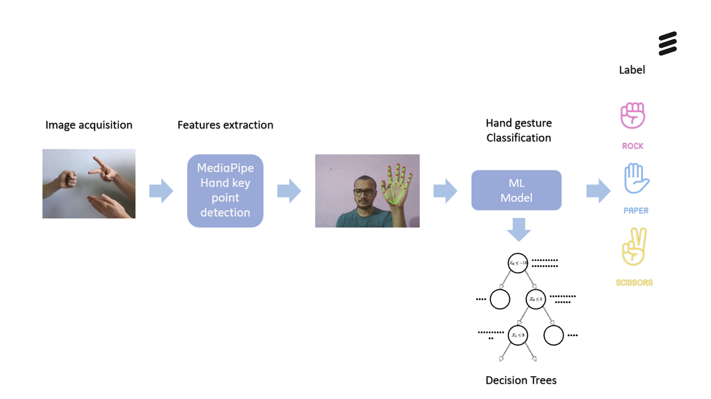
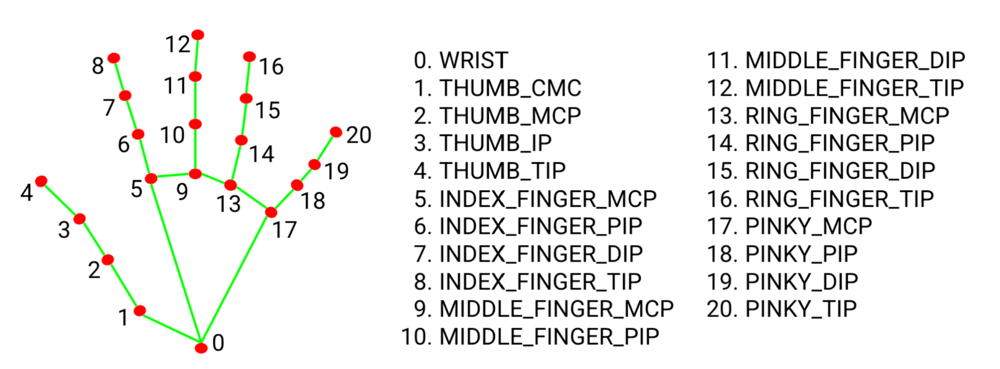

# AI4Kids-AI-Rock-Paper-Scissors

## Overview

This Python project implements the classic game of Rock, Paper, Scissors. The player's hand gesture is captured via a webcam, while the computer's choice is randomly generated. The results are displayed on the screen. The project demonstrates hand gesture recognition using computer vision and machine learning techniques.

The game pipeline consists of two main steps:  
1. **Hand Detection:** The Mediapipe library detects 21 key points of the user's hand from webcam input, leveraging deep learning techniques developed in TensorFlow.  
2. **Gesture Recognition:** A machine learning model (Random Forest) predicts hand gestures based on the coordinates of the detected key points.

This project highlights how computer vision and machine learning techniques enable machines to understand and respond to human gestures.

---

## Game Demo

---

## Hand Detection Pipeline

### **1. Image Acquisition**  
The webcam captures the images using the OpenCV Python library, which handles hardware communication and returns image data as NumPy arrays.

### **2. Feature Extraction**  
Captured video frames are preprocessed and fed into the [Mediapipe Hand Landmark Model](https://developers.google.com/mediapipe/solutions/vision/hand_landmarker). This model detects 21 hand-knuckle coordinates in hand regions, trained on a dataset of approximately 30,000 real-world and synthetic hand images.

### **3. Data Preprocessing**  
The detected hand points undergo preprocessing steps:
- **Data Augmentation:** Flipped and rotated images account for left/right hand biases and varying movements.
- **Normalization:** Min-Max or Z-score normalization is applied to manage variations in hand positions relative to the screen.

### **4. Hand Gesture Classification**  
A supervised learning approach is used to classify hand gestures (rock, paper, scissors).  
- **Training:** Models (Decision Tree Classifier and Random Forest Classifier) were trained using preprocessed hand key points and corresponding labels.  
- **Results:** The Random Forest Classifier achieved superior performance based on accuracy and F1 scores.

### **5. Label Prediction**  
Real-time hand gesture predictions are made using the trained model. The game outcome is determined based on the predicted gesture and a computer-generated random choice.

---

## Game Logic and Image Display

The game logic is implemented in Python, and OpenCV handles image display. Due to OpenCV's limitations with certain special characters (e.g., French accents), text images are generated using the Text to Image module from the Pillow (PIL) library. These images are displayed with transparent backgrounds for seamless integration.

---

## Supported Languages
- English
- French  

Languages can be selected in-game.

---

## Machine Learning Training Pipeline and Datasets

### **Data Used for Training:**  
- [Rock Paper Scissors Dataset 1](https://www.kaggle.com/datasets/yash811/rockpaperscissors)  
- [RPS Augmented Dataset](https://www.kaggle.com/datasets/unajacimovic/rps-augmented)  
- [Rock Paper Scissors Images](https://www.kaggle.com/datasets/shounakdesai/rock-paper-and-scissor-images)  
- [Webcam RPS Dataset](https://www.kaggle.com/datasets/divamkachoria/webcam-rps-dataset)  
- [Rock Paper Scissors Dataset](https://www.kaggle.com/datasets/glushko/rock-paper-scissors-dataset)  

### **Machine Learning Pipeline:**  
The gesture detection process uses key point coordinates and the Random Forest algorithm for classification. The Decision Tree algorithm was evaluated but yielded lower accuracy and F1 scores.

---

## Program Files and Folders

- **`Documentation` Folder:** Contains instructions for installing Python, running the project, and creating an executable for easy distribution.  
- **`Experiments` Folder:** Includes test cases and supporting functions useful for project improvement.  
- **`Utils` Folder:** Contains supporting files for `main.py`.  
    - **`languages` Folder:** Houses language-specific folders (English, French). Additional languages can be added.  
    - **`gui.py`:** Functions for game visuals, instructions, and language selection.  
    - **`language.py`:** Functions for language selection and generating corresponding text images.  
    - **`variables.py`:** Defines global variables used throughout the project.  
- **`Images` Folder:** Contains game images (non-language specific). Language-ready images can be generated using functions in the `Experiments` folder.  
- **`main.py`:** Activates OpenCV and manages game logic.

---

## Dependencies

Developed using Python 3.9.0. Detailed setup steps are available in the Documentation section.

---

## Contributors

- Francisco Perdigon Romero [LinkedIn](https://www.linkedin.com/in/fperdigon/) | [GitHub](https://github.com/fperdigon)  
- Pierre Thibault [LinkedIn](https://www.linkedin.com/in/pierre-thibault-089b60a/)  
- Marie Nashed [LinkedIn](https://www.linkedin.com/in/marie-n-0ba014245/) | [GitHub](https://github.com/MarieNashed)  
- Bhagya Chembakottu [LinkedIn](https://www.linkedin.com/in/bhagya-c/) | [GitHub](https://github.com/BhagyaC)  

---

## To-Do List

- Adapt image display to be relative to any screen size (current setup is 480x640).
- Optimize code to improve performance on low-end systems (e.g., skip detection for every frame).
- Ensure all game images are language-ready by default.

---

## License

This project is licensed under the MIT License.
>>>>>>> development
